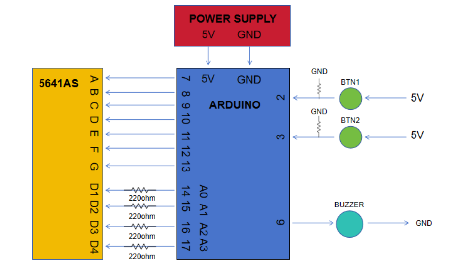
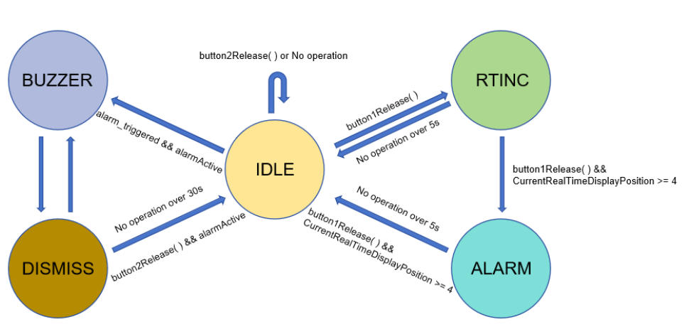

# Aduino Alarm Clock

 

**Project Description**: 
- This is a simple Arduino Uno made alarm clock project. 
- The purpose of this project is to have a good understanding of state machine, and gain experience of creating driver without relaying on the pre-built libraries. 
- It is a good practice for 4 x 7 segments. After completing this project, you will get good practice of `"Array, For Loop, State Machine, Creating Driver, and understanding how Segment LED works"`. 
- I hope everyone can learn something from this mid level project since there are no use of points, structures, algorithm, and data structures. 
- This project still can be improved significantly. Feel free to use it as template and improve the project your own!

 

**Project Setup:**
- IDE: VsCode(PlatformIO)
- Hardware requirement:
  - Arduino Uno x 1
  - 5641as 4 x 7 Segment module
  - push button x 2
  - 220ohm resistor x 4
  - active buzzer x 1
  - bread board x 1
  - jumper wires
- Required Library
        
        #include <TimeLib.h>

 

**Hardware Connection:**

- NOTE: The CAD schematic will be added in the future

 

**State Machine:**

